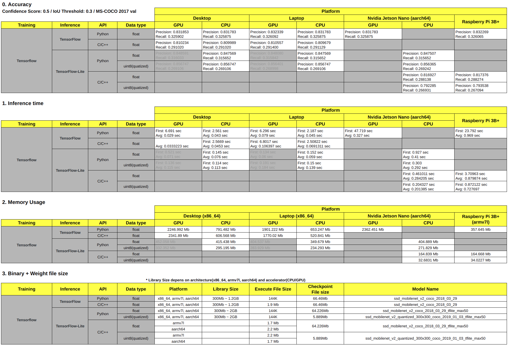

# My Tensorflow Test
개인적인 TensorFlow Test 입니다.   
성능 측정에 사용된 모든 코드는 이 Repo에 공개되어있습니다.  
질문/PR/Issue 언제든지 환영입니다.  
- [english](README.md)

### Result Screent Shot (2019/06/24)

### Tested Language
 - Python
 - C/C++

### Tested CPU & GPU
 - Nvidia RTX2080 (8Gb)
 - GeForce GTX 1050 Mobile (4Gb)
 - AMD Ryzen 2700 
 - Intel(R) Core(TM) i7-7700HQ CPU @ 2.80GHz
 - 128-core NVIDIA Maxwell™ architecture-based GPU
 - Quad-core ARM® A57
 - ARM Cortex-A53 1.4GHz
 
### Tested Framework 
 - TensorFlow
 - TensorFlow-Lite

### Tested Archtecture + CPU/GPU + Framework + Language + Precision
 - x86_64 + TensorFlow + GPU + Python API + Float32
 - x86_64 + TensorFlow + CPU + Python API + Float32
 - x86_64 + TensorFlow + GPU + C API + Float32
 - x86_64 + TensorFlow + CPU + C API + Float32
 - x86_64 + TensorFlow-Lite + CPU + Python API + Float32
 - x86_64 + TensorFlow-Lite + CPU + Python API + Int8
 - aarch64 + TensorFlow + GPU + Python API + Float32
 - aarch64 + TensorFlow-Lite + CPU + Python API + Float32
 - aarch64 + TensorFlow-Lite + CPU + Python API + Int8
 - aarch64 + TensorFlow-Lite + CPU + C++ API + Float32
 - aarch64 + TensorFlow-Lite + CPU + C++ API + Int8
 - armv7l + TensorFlow + CPU + Python API + Float32
 - armv7l + TensorFlow-Lite + CPU + C++ API + Float32
 - armv7l + TensorFlow-Lite + CPU + C++ API + Int8
 
### Google spreadsheet
 - [google spreadsheet link](https://docs.google.com/spreadsheets/d/1c6aFzBUg2X9_EmMgAaPeV_Yn6-wrXbCGIaexmatnhi0/edit?usp=sharing)

### Benchmark tool
#### Run
 - [TensorFlow/TensorFlow-Lite - Python API](app/python) 
 - [TensorFlow/TensorFlow-Lite - C/C++ API](app/cc#tensorflow--tensorflow-lite-cc-api-benchmark-app)
 
#### Build
You can build all benchmark tool using the source code in this repo.
 - [TensorFlow/TensorFlow-Lite - Python API](app/python)  
 - [TensorFlow - C API](app/cc/src#tensorflow-c-api)
 - [TensorFlow-Lite - C++ API](app/cc/src#tensorflow-lite-aarch64armv7l-c-benchmark-tool)

### Dataset 
[MS-COCO Validataion 2017](dataset)

### Models
[SSD Mobilenet v2](models)

